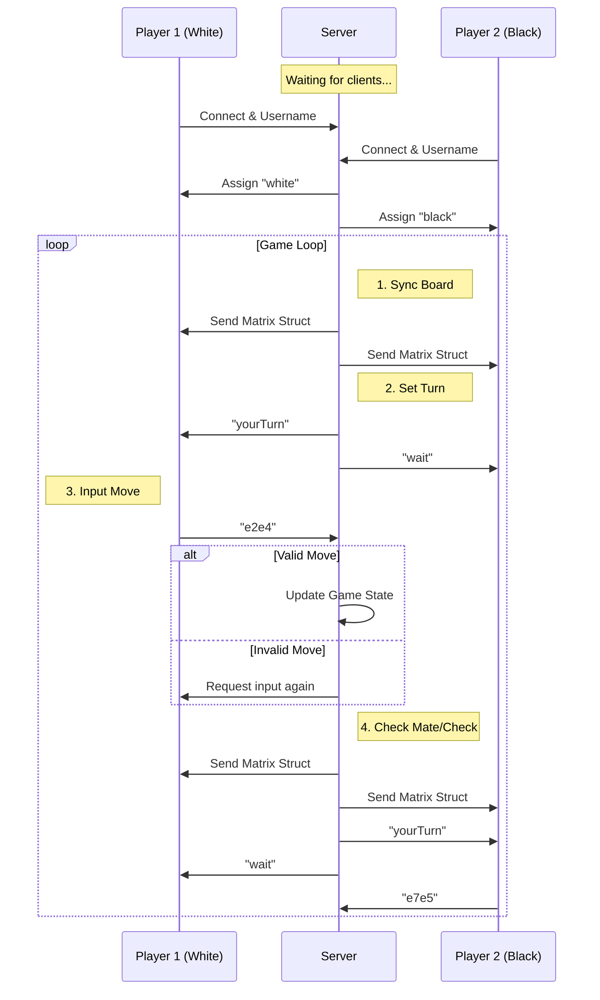

# ♟️ Multiplayer Console Chess (C & TCP Sockets)

A fully functional multiplayer chess system implemented in C. This project uses **TCP Sockets** for network communication and the **NCurses** library to render a graphical interface directly in the terminal.

The architecture follows a strict Client-Server model where the Server is the **"Source of Truth"**, handling the game state and move validation, while the Clients act as the interface for the players.

---

## 📖 Table of Contents
- [Features & Game Rules](#-features--game-rules)
- [Client-Server Architecture](#-client-server-architecture)
- [Communication Protocol](#-communication-protocol)
- [How to Play](#-how-to-play)

---

## 🌟 Features & Game Rules

The game logic is robustly implemented in `chessLogic.c`, covering standard chess regulations.

### Implemented Mechanics
* **Move Validation:** The server verifies the legality of every move based on piece type, path obstruction, and board boundaries.
* **Castling:** Supports both King-side and Queen-side castling (validates if King/Rook moved, path clearance, and check status).
* **En Passant:** Correctly handles capturing pawns "in passing".
* **Pawn Promotion:** Pawns are automatically promoted (defaulting to Queen) when reaching the opposite end of the board.
* **Game State Detection:**
    * **Check:** Detects when a King is threatened.
    * **Checkmate:** Ends the game when the King has no legal moves.
    * **Stalemate:** Ends in a draw if the player is not in check but has no legal moves.
    * **Insufficient Material:** Automatically detects draw scenarios (e.g., King vs King).

### Special Commands
In addition to standard moves, players can use:
* `resign` - Forfeit the match (instant loss).
* `draw` - Propose a draw (opponent must respond with `yes` or `no`).
* `quit` - Disconnect from the server.

---

## 🏗 Client-Server Architecture

The system uses a concurrent model based on **POSIX Threads (`pthread`)**.

1.  **Server (`server.c`):**
    * Listens for connections on port `8080`.
    * When two clients connect, it spawns a dedicated thread (`startGame`) to manage their specific match.
    * Maintains the `Game_T` structure and validates moves using `chessLogic.c`.

2.  **Client (`client.c`):**
    * Connects to the server IP.
    * Receives the board matrix (`Element_T`) and renders it visually using `GUI.c`.
    * Captures user input (moves or commands) and sends it to the server.

---

## 📡 Communication Protocol

Communication is synchronous and follows a strict flow controlled by the server.

### Data Flow Diagram

## How to Play

Execute all the files using the command: make all
After that, you need at least 3 terminals runing:
- In the first one you will run the command: ./server
- In the othet two terminals you will run the command: ./client to be a player

- An example of beta version for Chess Game (without graphic design) 

